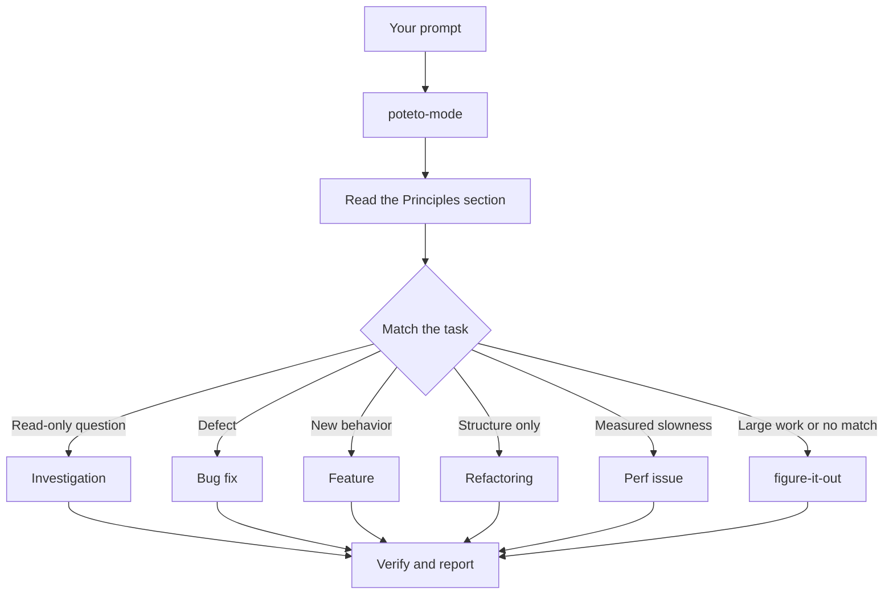

# Route work through `$pstack`

`$pstack` is the front door. You give it a goal, it matches one of twenty-two playbooks, copies that playbook's steps into the Codex plan, and loads the other payload instructions as the steps need them. In this page you learn what a good prompt looks like, and how little of one you actually need.


## What happens to your prompt



The diagram shows the common routes. There are also playbooks for hillclimbing a metric, diagnosing runtime symptoms and captured traces, prototypes, visual parity, authoring and evaluating skills, autonomous runs, babysitting a PR or stack to merge-ready, shipping a verified stack, running a PR queue on autopilot, orchestrating project-scale programs, session pickup, pausing safely, multi-phase plans, and worktree cleanup. The [playbook directory](../../skills/poteto-mode/playbooks/) has the full set.

## Say the goal, not the ceremony

You don't write a spec. You say what's wrong or what you want, plus anything you already know that saves the agent time:

```text
$pstack users get two notifications after a retry. repro first, then fix and verify.
```

That's a Bug fix prompt. "repro first" is a real constraint, not politeness, and the playbook honors it. Watch the Codex plan fill with the Bug fix steps. A skipped step stays visible with `skip: <reason>`.

When the conversation already carries the context, the prompt shrinks to almost nothing. Codex selects skills per turn, so keep the `$pstack` prefix on each follow-up:

```text
$pstack do it
```

```text
$pstack continue
```

```text
$pstack keep going until done
```

Short works because the active task carries the context and `$pstack` reloads the playbook structure for that turn. Your words carry the intent, and the skill carries the rigor.

## Switch tasks with "new task"

A long task accumulates context from the last subject. When you change subjects, say so:

```text
$pstack new task. figure out why the cache entry survives logout. don't change any code yet.
```

"new task" tells `$pstack` to re-match rather than continue the prior playbook. "don't change any code yet" pins this one to Investigation. Without those two phrases, a mode mid-Feature tends to treat your question as the next feature step.

## Give parallel work its own worktree

If you run several agents against one repository, they will fight over the working tree. Ask for isolation up front:

```text
$pstack new task. branch off <base> in a fresh worktree, then port the parser change there.
```

Each task in its own branch and worktree means no agent stomps another's files. The [Opening a PR playbook](../../skills/poteto-mode/playbooks/opening-a-pr.md) already works from a worktree for code changes, so mostly you only say this when a specific base or location matters.

Worktrees accumulate. When disk gets tight, ask:

```text
$pstack what's eating my disk? prune the worktrees that are safe to prune.
```

The [Worktree cleanup playbook](../../skills/poteto-mode/playbooks/worktree-cleanup.md) classifies every worktree by merge state, uncommitted work, and any active Codex task evidence available. It deletes only what that evidence clears and pauses for your call on anything holding uncommitted work or uncertain ownership.

## Leave it running

When you step away, say what done means and go:

```text
$pstack im stepping away. keep going until the migration check reports zero old callers. log your decisions. use /goal until done.
```

Codex `/goal` keeps checking the finish condition within the authority and permissions you supplied. Work you'll review later routes through [`$pstack figure-it-out`](../../skills/figure-it-out/SKILL.md), which designs the run's phases and keeps a [`$pstack show-me-your-work`](../../skills/show-me-your-work/SKILL.md) decision log. [Run work while you sleep](./07-overnight.md) covers the full overnight contract.

**Pitfall:** don't enumerate skills in your prompt ("use $pstack how, then $pstack architect, then $pstack arena..."). The playbook already sequences them, and a hand-written sequence usually reorders or drops steps the playbook would have kept. Name a skill only when you want to override a specific choice.

Read [`poteto-mode`](../../skills/poteto-mode/SKILL.md) itself for the full routing rules.

Next: [Understand the code](./03-understand.md).
